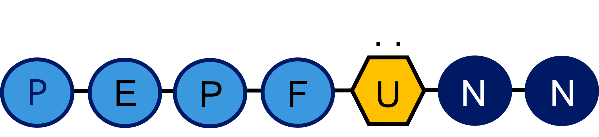
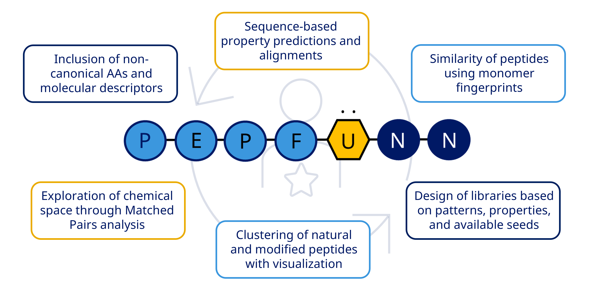

# PepFuNN



## Purpose

Here we present PepFuNN, a package for the analysis of natural and modified peptides using a set of modules to study their sequences, including design of libraries, and peptide clustering and similarity analysis.

## Required third-party tools

The package relies mostly on the external packages RDKit (https://rdkit.org/) and BioPython (https://biopython.org/).

## Quick installation

The module is available in pypi, which allow installing stable versions with:

`pip install pepfunn`

## Main functions



## Notebooks

A folder called `notebooks` include a set of jupyter scripts per module available in PepFuNN. The notebooks contains the main functionalities with various peptide sequences as input, and generate output files in the same folder to check and compare the obtained results.

## Tests

A set of unit tests are available in the `tests` folder. These can be run separately per module by calling each test script, or all can be tested at the same time using the `test.py` file.

```Bash
python test.py
```

## References

If you use PepFuNN in your work, please cite the following papers:

* 'PepFuNN: Novo Nordisk open-source toolkit to enable peptide in silico analysis', Preprint. Link: ---.
* 'PepFun 2.0: improved protocols for the analysis of natural and modified peptides', Future Drug Discovery, 2023. Link: https://www.future-science.com/doi/10.4155/fdd-2023-0004
* 'PepFun: Open Source Protocols for Peptide-Related Computational Analysis', Molecules, 2021. Link: https://www.mdpi.com/1420-3049/26/6/1664

## Contact

For any questions, please contact: raoc@novonordisk.com
